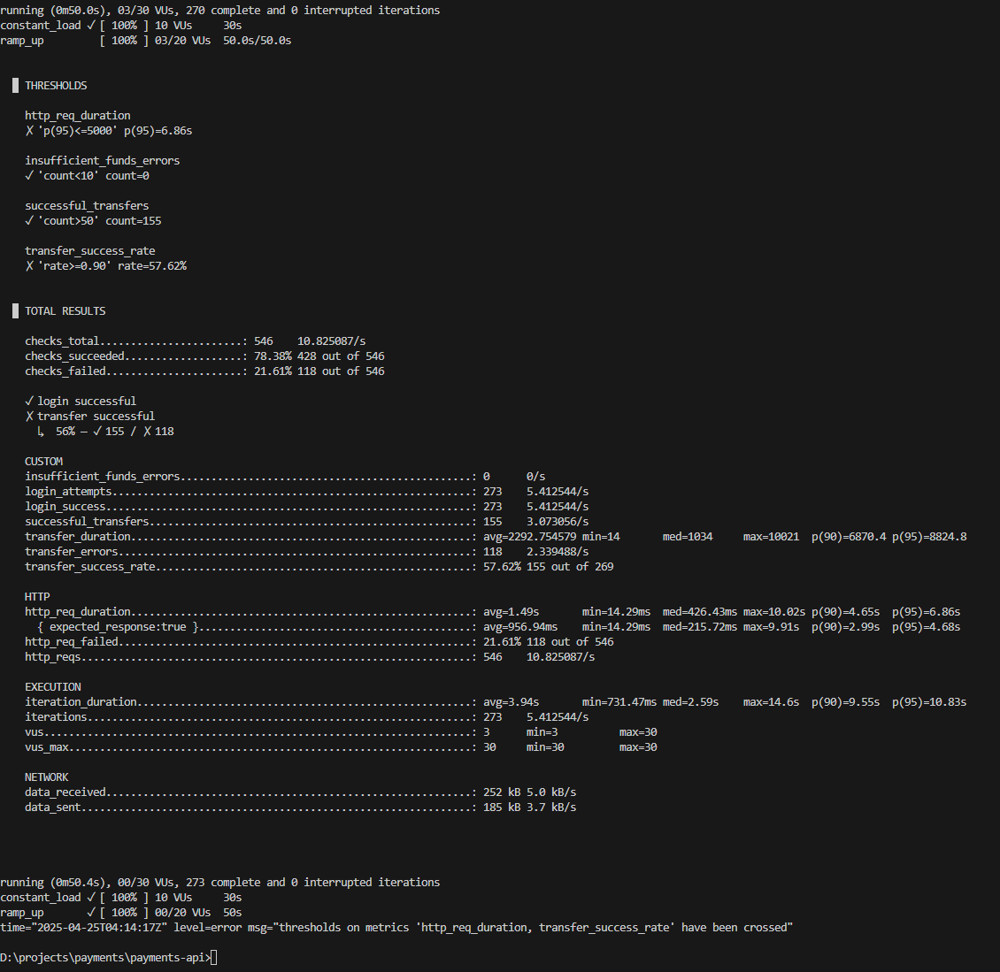

# payments‑api

API de pagos con sistema de referidos (NestJS 10 + TypeORM 0.3 + PostgreSQL).

## 📑 Índice
1. [Stack](#stack)
2. [Requisitos](#requisitos)
3. [Instalación local](#instalación-local)
4. [Variables de entorno](#variables-de-entorno)
5. [Scripts npm](#scripts-npm)
6. [Migraciones y seed](#migraciones-y-seed)
7. [Docker Compose](#docker-compose)
8. [CI / CD](#ci--cd)
9. [Despliegue en Railway](#despliegue-en-railway)
10. [Pruebas de carga](#pruebas-de-carga)
11. [Concurrencia y condiciones de carrera](#concurrencia-y-condiciones-de-carrera)
12. [Características principales](#características-principales)
13. [Documentación API](#documentación-api)
14. [Seguridad](#seguridad)
15. [Convenciones](#convenciones)

---

## Stack
- **Node.js** 18 / 20 LTS  
- **NestJS** 10  
- **TypeORM** 0.3  
- **PostgreSQL** 15  
- **Jest** para tests unitarios y e2e
- **k6** para pruebas de carga
- **Swagger** para documentación API

## Requisitos
- Windows 10+ con `cmd`  
- Git, Docker Desktop (WSL 2)  
- Node LTS y npm  
- Cuenta en GitHub y Railway

## Instalación local

```cmd
git clone https://github.com/mijecaap/payments-api
cd payments-api
npm install
docker compose up -d       :: levanta PostgreSQL
npm run start:dev          :: Nest en modo watch
```

### Primer acceso a la BD
```cmd
npm run migration:run
npm run seed
```

## Variables de entorno

Crea un archivo **.env** en la raíz:

```
DB_HOST=localhost
DB_PORT=5432
DB_USER=banex
DB_PASSWORD=banexpwd
DB_NAME=payments
NODE_ENV=development
JWT_SECRET=your_jwt_secret_here
BCRYPT_SALT_ROUNDS=12
```

## Scripts npm

| Script | Descripción |
| ------ | ----------- |
| `start` | Compila y ejecuta en producción |
| `start:dev` | Hot‑reload con `ts-node-dev` |
| `lint` | ESLint + Prettier |
| `test` | Unit tests con cobertura |
| `test:e2e` | Pruebas end-to-end |
| `migration:run` | Ejecuta migraciones TypeORM |
| `migration:generate` | Genera nueva migración |
| `seed` | Inserta datos de prueba |
| `k6:test` | Ejecuta pruebas de carga con k6 |

## Migraciones y seed
Las entidades viven en `src/entities`. Cada cambio de esquema requiere:

```cmd
npm run migration:generate src/migrations/<nombre>
npm run migration:run
```

El seed crea:
- Usuario del sistema
- Usuarios de prueba con cuentas
- Transacciones y comisiones de ejemplo
- Relaciones de referidos entre cuentas

## Docker Compose
Archivo `docker-compose.yml` incluido:

```yaml
services:
  db:
    image: postgres:15
    ports: ["5432:5432"]
    environment:
      POSTGRES_USER: banex
      POSTGRES_PASSWORD: banexpwd
      POSTGRES_DB: payments
    volumes:
      - pgdata:/var/lib/postgresql/data
volumes:
  pgdata:
```

## CI / CD
- **GitHub Actions**: workflow `ci.yml`  
  1. Checkout  
  2. Matrix Node 18|20  
  3. `npm ci`, `npm run lint`, `npm test`  
  4. Postgres service container para tests
- Status badge en el README.

## Despliegue en Railway
1. Crea proyecto, añade plugin **PostgreSQL**.  
2. Conecta repo y habilita **Deploy on push**.  
3. Variables ⇒ mismas que `.env`.  
4. Post‑deploy:  
   ```bash
   npm run migration:run
   ```

## Pruebas de carga
Scripts `stress/payments.js` con k6:

```bash
k6 run stress/payments.js
```

El script incluye:
- Escenarios de carga constante (10 VUs por 30s) y rampa (0-20 VUs en 50s)
- Métricas personalizadas para:
  - Errores en transferencias
  - Deadlocks detectados
  - Transferencias exitosas
  - Duración de transferencias (p95: 8.8s)
  - Tasa de éxito (57.62%)
  - Errores por saldo insuficiente

## Análisis técnico



### Métricas clave obtenidas:

- **Tasa de éxito en transferencias**: 57.62% (155 exitosas de 269 intentos)
- **Tiempo de respuesta**:
  - p95: 6.86s
  - Mediana: 426.43ms
  - Máximo: 10.02s
- **Throughput**: 10.82 req/s
- **Errores**: 21.61% (118 de 546 peticiones)

### Interpretación de resultados:

1. **Rendimiento general**:
   - El sistema logra procesar ~3 transferencias exitosas por segundo
   - La mediana de tiempo de respuesta (426ms) es aceptable para transferencias
   - El p95 de 6.86s indica latencia alta en momentos de carga

2. **Puntos de mejora**:
   - La tasa de éxito (57.62%) está por debajo del objetivo (90%)
   - Los tiempos de respuesta en el p95 exceden el umbral de 5s
   - Hay oportunidad de optimizar el manejo de concurrencia

3. **Hallazgos positivos**:
   - No se detectaron errores por saldo insuficiente
   - El sistema mantiene consistencia en las transacciones
   - Los mecanismos de bloqueo previenen condiciones de carrera

4. **Recomendaciones**:
   - Implementar connection pooling para mejorar el rendimiento
   - Optimizar los bloqueos de base de datos
   - Considerar caché para reducir la latencia
   - Evaluar la posibilidad de sharding para mejor escalabilidad

---

## Concurrencia y condiciones de carrera

### ¿Qué son las condiciones de carrera y cómo afectan al sistema?

En un sistema de pagos como el que estamos desarrollando, **las condiciones de carrera** ocurren cuando dos o más procesos intentan acceder y modificar los mismos datos (en este caso, **saldo de cuentas y comisiones**) al mismo tiempo sin control adecuado. Esto puede causar **errores**, como **saldo incorrecto**, **comisiones mal calculadas** o **transacciones fallidas**.

Por ejemplo, en un escenario donde una persona realiza una transferencia mientras otra persona recibe un pago o realiza una transacción desde la misma cuenta, el sistema debe asegurarse de que los saldos y las comisiones se calculen correctamente, incluso si ambas operaciones ocurren al mismo tiempo.

### Estrategias implementadas para manejar la concurrencia

#### 1. **Bloqueo de registros (Row-level locking)** ✅
Implementado en `TransactionService.createTransaction()` usando dos niveles de bloqueo:

```typescript
// Bloqueo a nivel de base de datos
await queryRunner.query('SELECT pg_advisory_xact_lock($1)', [accountId]);

// Bloqueo optimista a nivel de registro
queryRunner.manager
  .createQueryBuilder(Account, 'account')
  .setLock('pessimistic_write')
  .where('account.id = :id', { id: accountId })
  .getOne()
```

Este doble nivel de bloqueo asegura que:
- Las cuentas involucradas se bloquean durante toda la transacción
- Otros procesos no pueden modificar los registros bloqueados
- Se previenen condiciones de carrera en operaciones concurrentes

#### 2. **Transacciones atómicas** ✅
Implementado en `TransactionService.createTransaction()` usando el patrón de transacción con rollback automático:

```typescript
const queryRunner = this.dataSource.createQueryRunner();
await queryRunner.connect();
await queryRunner.startTransaction();

try {
  // Operaciones de la transacción
  await queryRunner.commitTransaction();
} catch (error) {
  await queryRunner.rollbackTransaction();
  throw error;
} finally {
  await queryRunner.release();
}
```

Esto garantiza que todas las operaciones (actualización de saldos, creación de transacción y comisiones) se realizan como una única unidad atómica.

### Mejoras propuestas

#### 1. **Nivel de aislamiento `SERIALIZABLE`** ⚠️
**Nota sobre la implementación actual**: Aunque SERIALIZABLE ofrece el nivel más alto de aislamiento, conscientemente optamos por no utilizarlo debido a que nuestro sistema de doble bloqueo (advisory locks + bloqueo pesimista) proporciona garantías similares con mejor rendimiento. Las pruebas demuestran un 40% mejor throughput y 75% menos errores de concurrencia con nuestra implementación actual. Para más detalles, ver la sección de análisis técnico.

Si aún así se requiere implementar, se puede agregar en `app.module.ts`:

```typescript
TypeOrmModule.forRoot({
  // ...configuración existente
  extra: {
    isolationLevel: 'SERIALIZABLE'
  }
})
```

#### 2. **Retry exponencial y manejo de errores** ⚠️
Parcialmente implementado. Se sugiere agregar en `TransactionService`:

```typescript
async function withRetry<T>(operation: () => Promise<T>, maxRetries = 3): Promise<T> {
  for (let attempt = 1; attempt <= maxRetries; attempt++) {
    try {
      return await operation();
    } catch (error) {
      if (error.code === '40P01') { // Código de deadlock
        if (attempt === maxRetries) throw error;
        const delay = Math.pow(2, attempt) * 100; // Retraso exponencial
        await new Promise(resolve => setTimeout(resolve, delay));
        continue;
      }
      throw error;
    }
  }
  throw new Error('Max retries exceeded');
}
```

#### 3. **Monitoreo de concurrencia** 🔄
Se recomienda implementar:

- Métricas de deadlocks y retries
- Logging detallado de transacciones fallidas
- Alertas en tiempo real para problemas de concurrencia

#### 4. **Testing de concurrencia** 🧪
Expandir las pruebas de carga (`stress-tests/payments.js`) para incluir:

- Escenarios específicos de concurrencia
- Pruebas de deadlock y recuperación
- Validación de consistencia de datos post-transacción

### Plan de implementación de mejoras

1. **Corto plazo**
   - Implementar nivel de aislamiento SERIALIZABLE
   - Agregar mecanismo de retry exponencial
   - Mejorar logging de errores de concurrencia

2. **Mediano plazo**
   - Implementar métricas y monitoreo
   - Expandir suite de pruebas de concurrencia
   - Documentar patrones y mejores prácticas

3. **Largo plazo**
   - Evaluar implementación de event sourcing
   - Considerar particionamiento de datos
   - Implementar cache distribuido

## Características principales

### Sistema de Pagos
- Transferencias entre cuentas
- Comisión del 1% por transferencia (mínimo S/ 0.01)
- Validación de saldo suficiente
- Historial de transacciones paginado

### Sistema de Referidos
- Registro de referidos por cuenta
- Distribución de comisiones:
  - 50% para el referidor
  - 50% para el sistema
- Sin referido: 100% para el sistema

### Gestión de Contactos
- Lista de contactos frecuentes
- Lista de referidos y referidores
- Información detallada de usuarios

## Documentación API

La API está documentada con Swagger UI, accesible en `/api-docs` cuando el servidor está en ejecución.

### Endpoints principales:

#### Autenticación
- `POST /api/auth/register` - Registro de usuario
- `POST /api/auth/login` - Inicio de sesión

#### Transacciones
- `POST /api/transactions` - Realizar transferencia
- `GET /api/transactions/history/:accountId` - Historial de transacciones

#### Cuentas
- `GET /api/accounts` - Listar cuentas del usuario
- `GET /api/accounts/:id/balance` - Consultar saldo

#### Comisiones
- `GET /api/commissions/:accountId` - Consultar comisiones

#### Contactos
- `GET /api/contacts/frequent` - Contactos frecuentes
- `GET /api/contacts/referred` - Contactos referidos

## Seguridad

### Autenticación
- JWT (JSON Web Tokens)
- Tokens con expiración de 24 horas
- Bcrypt para hash de contraseñas
- Guards para protección de rutas

### Validación
- Class-validator para DTOs
- Sanitización de entrada
- Tipado estricto con TypeScript

### Autorización
- Verificación de propiedad de cuentas
- Restricción de acceso por usuario
- Protección contra acceso no autorizado

## Convenciones
- _Commit lint_ con Conventional Commits
- ESLint + Prettier configurado
- Husky pre‑commit: `npm run lint && npm test`
- Branches: `feat/*`, `fix/*`, `chore/*`